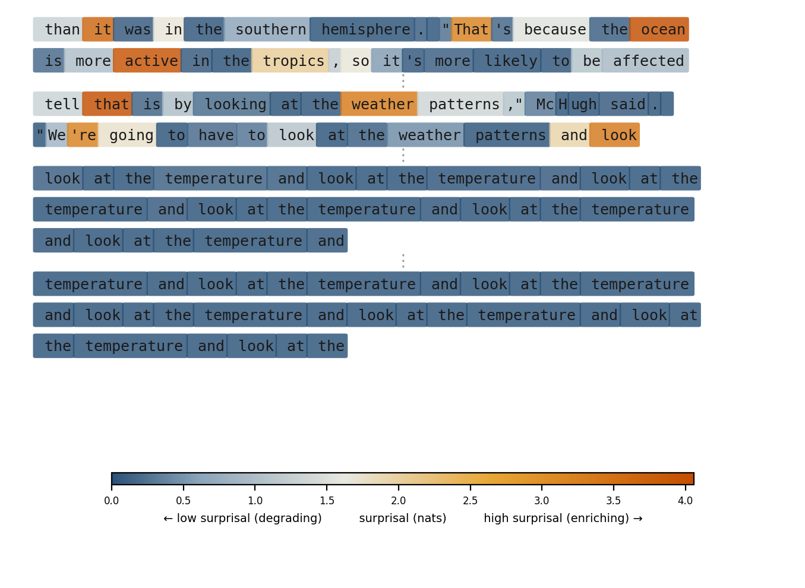
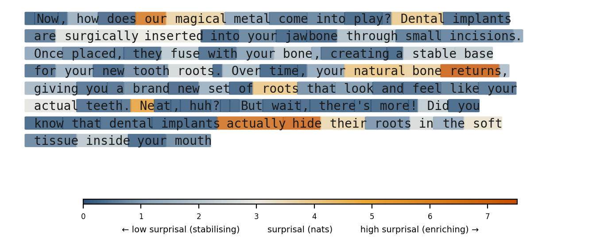
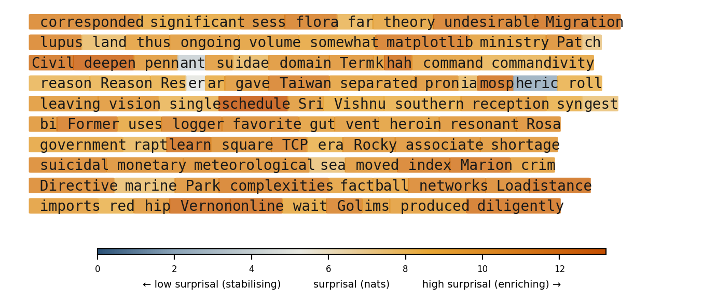

# Integration

**Compression, distortion, novelty, and meaning in large language models**

**[Read the paper →](https://ddisisto.github.io/integration-framework/integration.html)** · **[PDF](https://ddisisto.github.io/integration-framework/integration.pdf)**

## What this is about

Every token a language model generates comes with a surprisal value — the model's own prediction error, computed for free as part of inference. We use it during training (it's the loss function). We occasionally inspect it for debugging. And then, at inference time, we throw it away.

This paper argues that's a mistake, and that the reason it's a mistake reveals something fundamental about what these systems are doing.

## The framework

The paper treats what LLMs do as hierarchical multi-scale compression, and the autoregressive loop as sequential coding through a bandwidth-limited channel. Within this framework:

- **The forward pass** builds progressively more abstract representations across layers, each solving a rate-distortion problem under a more abstract distortion measure. What grows across depth is not information about the input (the data processing inequality forbids that) but the *organisation* of preserved information — statistical complexity in the computational mechanics sense.

- **The autoregressive loop** projects this rich internal state through a radical bottleneck — one token at a time. Surprisal at each token is a real-time signal about whether generation is doing novel compressive work or reinforcing existing trajectories. The *enrichment fraction* over a window of generation characterises the regime: productive, degenerate, or noise.

- **The distinction is measurable.** High enrichment fraction with coherence = productive generation. Low enrichment fraction = attractor collapse (the repetitive loops everyone has seen). Very high enrichment fraction = noise (the model surprising itself because it's lost structure, not because it's generating novelty). These regimes are invisible in fluency metrics but directly observable in surprisal dynamics:

<p align="center">



</p>

## Why it matters beyond the model

The same bottleneck operates in biological communication. Coupé et al. (2019) measured convergence on roughly 39 bits per second across 17 languages — but that's just the lexical channel. Face-to-face, humans communicate surprisal *itself* through involuntary channels: widened eyes, prosodic shifts, changes in posture. These are real-time broadcasts of prediction error — low-bandwidth but high-value signal about where the listener's model diverged from what the speaker said.

Speakers calibrate in real time based on this. LLMs have none of it. The model computes surprisal at every token but doesn't broadcast it. The user has no involuntary leakage channel either. Both sides of the calibration loop that biological communication relies on are structurally absent.

This sharpens the alignment problem: the binding constraint isn't feedback *quality* but feedback *bandwidth* — and specifically the absence of involuntary, credible, real-time signal about internal states. The paper develops this formally; a companion piece on the ecological implications is in progress.

## An open question

If we build systems that surface model surprisal as a communication signal — uncertainty displays, confidence indicators, attention visualisations — these are *constructed* channels, fully voluntary. They can be gamed, tuned, optimised. They lack the credibility that comes from being involuntary.

**Can a deliberately constructed transparency channel ever do the calibrating work that involuntary leakage does? Or does the credibility gradient require that the signal be outside the sender's control?**

## The paper

The paper develops seven testable predictions, reframes the grounding problem as a rate-distortion question, and characterises alignment as a projection bottleneck between the receiver's distortion measure and the narrow feedback channels available to communicate it. Formal foundations (rate-distortion, statistical complexity, sequential coding) are in the appendix.

This is a living document (currently v0.5). Independent research — no affiliation, no funding, no product.

**[Read the full paper →](https://ddisisto.github.io/integration-framework/integration.html)**

## Building locally

Requires Python, [Quarto](https://quarto.org), and TinyTeX.

```bash
python -m venv .venv && source .venv/bin/activate
pip install -r requirements.txt
quarto render paper   # outputs to docs/
```

## License

This work is licensed under [CC BY-SA 4.0](https://creativecommons.org/licenses/by-sa/4.0/).
